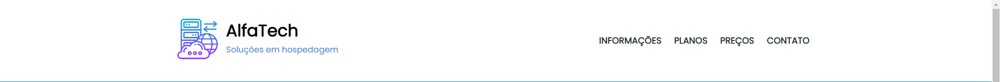
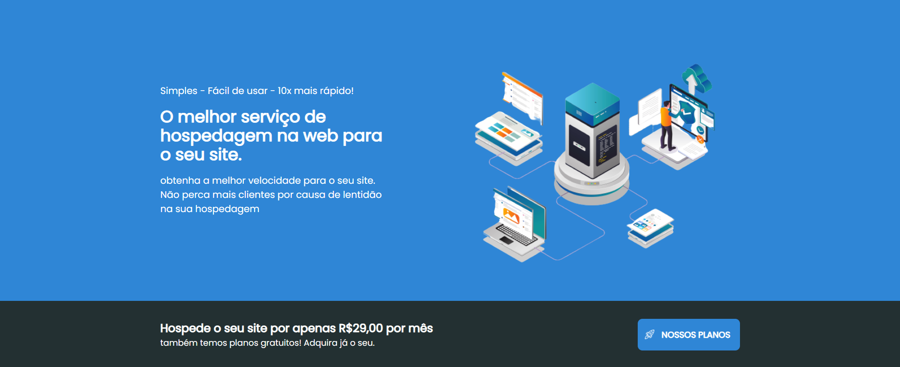
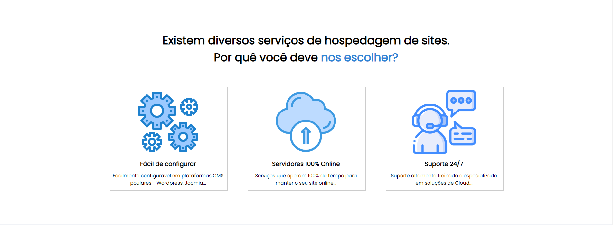
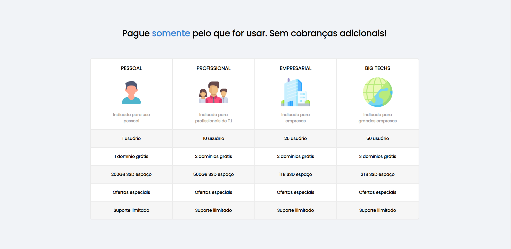
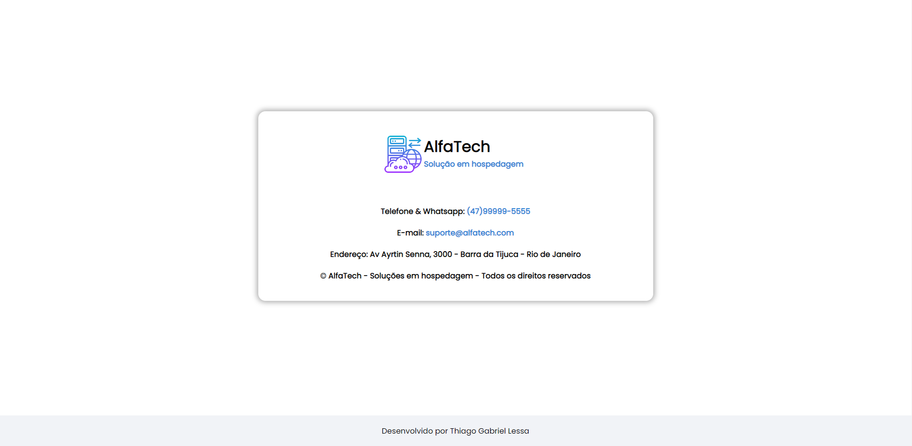
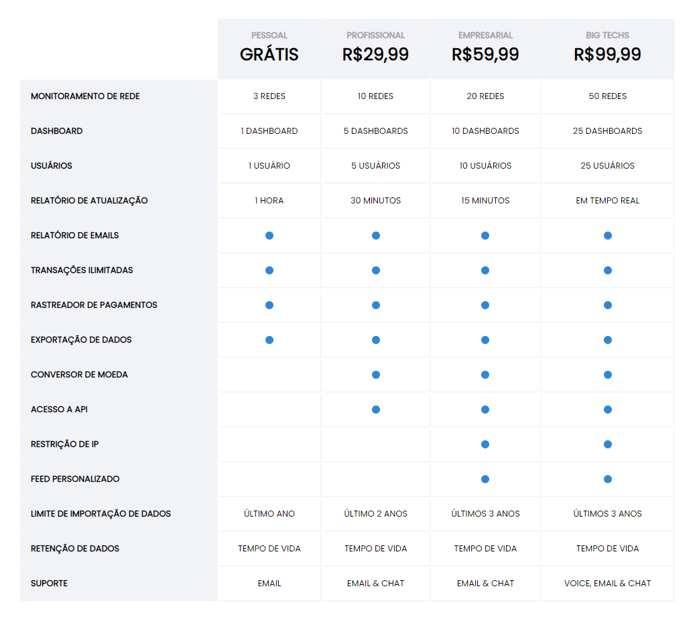

Olá, bem-vindo ao projeto AlphaTech!

Este é um dos projetos feitos com os ensinamentos de HTML e CSS adquiridos pela DevMedia. O projeto não possui finalidade lucrativa, foi feito somente para por em prática o estudo!

O projeto é bem simples, ele tem como finalidade apresentar um site de hospedagem web, contendo informações sobre o serviço, vantagens de cada plano, e seus preços. O projeto ainda será refatorado, aplicando uma responsividade.

Abaixo temos um vídeo com o funcionamento das páginas:

<video src="assets/videos/Funcionamento_site.mp4" controls>
    Seu navegador não suporta o vídeo, siga para as imagens abaixo!
</video>

No topo da página possui uma nav bar com links nos quais redirecionam para partes da própria página, com exceção do link "PREÇOS", que lhe redireciona para outra página.

    

Descendo um pouco, há uma seção insentivando o uso da hospedagem deles e logo abaixo uma propaganda com um outro link que redireciona para outra página com preços dos planos:

    

Logo abaixo possui uma seção apresentando um pouco das vantagens de escolher os planos:

    

Em seguida há uma seção com uma tabela dos planos, contendo plano pessoal, profissional, empresarial e big techs, cada um com suas vantagens próprias:

    

A próxima seção apresenta uma segunda propaganda com um outro link que redireciona para outra página com preços dos planos:

    

E por fim da primeira página, há a última seção, possuindo um card com o contato da empresa:

    

----------------------------------------------------------------------------SEGUNDA PÁGINA DO PROJETO-----------------------------------------------------------------------------

Clicando no link PREÇOS na nav bar, você será redirecionado para esta página de preços:

    

Está página possui uma nav bar:

    

E na seção abaixo da nav bar, possui a tabela de preços de cada plano e suas vantagens:

    

